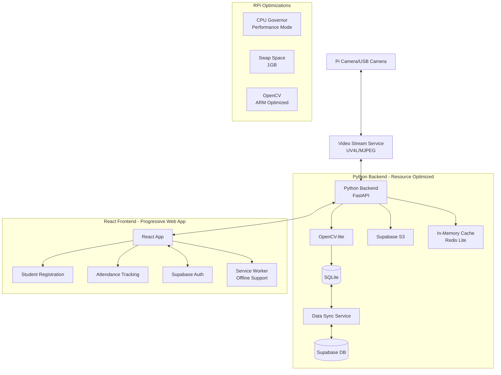
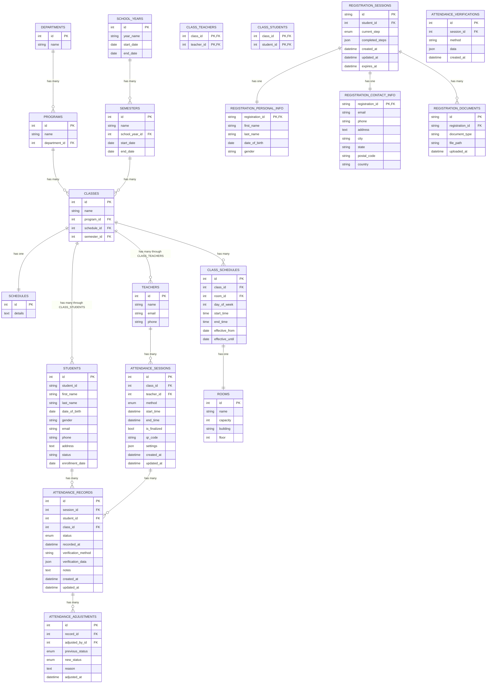

```mermaid
flowchart TD
    C[Pi Camera/USB Camera] <--> VS[Video Stream Service\nUV4L/MJPEG]
    VS <--> P[Python Backend\nFastAPI]
    
    subgraph Backend [Python Backend - Resource Optimized]
        P --> CV[OpenCV-lite]
        CV --> SL[(SQLite)]
        P --> S3[Supabase S3]
        SL <--> SYNC[Data Sync Service]
        SYNC <--> SDB[(Supabase DB)]
        P --> CACHE[In-Memory Cache\nRedis Lite]
    end
    
    subgraph Frontend [React Frontend - Progressive Web App]
        R[React App] --> SR[Student Registration]
        R --> AT[Attendance Tracking]
        R <--> AUTH[Supabase Auth]
        R --> PWA[Service Worker\nOffline Support]
    end
    
    P <--> R
    
    subgraph RPi [RPi Optimizations]
        OPT1[CPU Governor\nPerformance Mode]
        OPT2[Swap Space\n1GB]
        OPT3[OpenCV\nARM Optimized]
    end
```

```mermaid
erDiagram
    DEPARTMENTS {
        int id PK
        string name
    }
    PROGRAMS {
        int id PK
        string name
        int department_id FK
    }
    SCHOOL_YEARS {
        int id PK
        string year_name
        date start_date
        date end_date
    }
    SEMESTERS {
        int id PK
        string name
        int school_year_id FK
        date start_date
        date end_date
    }
    SCHEDULES {
        int id PK
        text details
    }
    CLASSES {
        int id PK
        string name
        int program_id FK
        int schedule_id FK
        int semester_id FK
    }
    TEACHERS {
        int id PK
        string name
        string email
        string phone
    }
    STUDENTS {
        int id PK
        string student_id
        string first_name
        string last_name
        date date_of_birth
        string gender
        string email
        string phone
        text address
        string status
        date enrollment_date
    }
    CLASS_TEACHERS {
        int class_id PK,FK
        int teacher_id PK,FK
    }
    CLASS_STUDENTS {
        int class_id PK,FK
        int student_id PK,FK
    }
    REGISTRATION_SESSIONS {
        string id PK
        int student_id FK
        enum current_step
        json completed_steps
        datetime created_at
        datetime updated_at
        datetime expires_at
    }
    REGISTRATION_PERSONAL_INFO {
        string registration_id PK,FK
        string first_name
        string last_name
        date date_of_birth
        string gender
    }
    REGISTRATION_CONTACT_INFO {
        string registration_id PK,FK
        string email
        string phone
        text address
        string city
        string state
        string postal_code
        string country
    }
    REGISTRATION_DOCUMENTS {
        string id PK
        string registration_id FK
        string document_type
        string file_path
        datetime uploaded_at
    }
    ATTENDANCE_SESSIONS {
        int id PK
        int class_id FK
        int teacher_id FK
        enum method
        datetime start_time
        datetime end_time
        bool is_finalized
        string qr_code
        json settings
        datetime created_at
        datetime updated_at
    }
    ATTENDANCE_RECORDS {
        int id PK
        int session_id FK
        int student_id FK
        int class_id FK
        enum status
        datetime recorded_at
        string verification_method
        json verification_data
        text notes
        datetime created_at
        datetime updated_at
    }
    ATTENDANCE_VERIFICATIONS {
        int id PK
        int session_id FK
        string method
        json data
        datetime created_at
    }
    ATTENDANCE_ADJUSTMENTS {
        int id PK
        int record_id FK
        int adjusted_by_id FK
        enum previous_status
        enum new_status
        text reason
        datetime adjusted_at
    }
    ROOMS {
        int id PK
        string name
        int capacity
        string building
        int floor
    }
    CLASS_SCHEDULES {
        int id PK
        int class_id FK
        int room_id FK
        int day_of_week
        time start_time
        time end_time
        date effective_from
        date effective_until
    }

    DEPARTMENTS ||--o{ PROGRAMS : "has many"
    PROGRAMS ||--o{ CLASSES : "has many"
    SCHOOL_YEARS ||--o{ SEMESTERS : "has many"
    SEMESTERS ||--o{ CLASSES : "has many"
    CLASSES ||--|| SCHEDULES : "has one"
    CLASSES ||--o{ TEACHERS : "has many through CLASS_TEACHERS"
    CLASSES ||--o{ STUDENTS : "has many through CLASS_STUDENTS"
    CLASSES ||--o{ CLASS_SCHEDULES : "has many"
    TEACHERS ||--o{ ATTENDANCE_SESSIONS : "has many"
    STUDENTS ||--o{ ATTENDANCE_RECORDS : "has many"
    ATTENDANCE_SESSIONS ||--o{ ATTENDANCE_RECORDS : "has many"
    ATTENDANCE_RECORDS ||--o{ ATTENDANCE_ADJUSTMENTS : "has many"
    REGISTRATION_SESSIONS ||--|| REGISTRATION_PERSONAL_INFO : "has one"
    REGISTRATION_SESSIONS ||--|| REGISTRATION_CONTACT_INFO : "has one"
    REGISTRATION_SESSIONS ||--o{ REGISTRATION_DOCUMENTS : "has many"
    CLASS_SCHEDULES ||--|| ROOMS : "has one"

```
